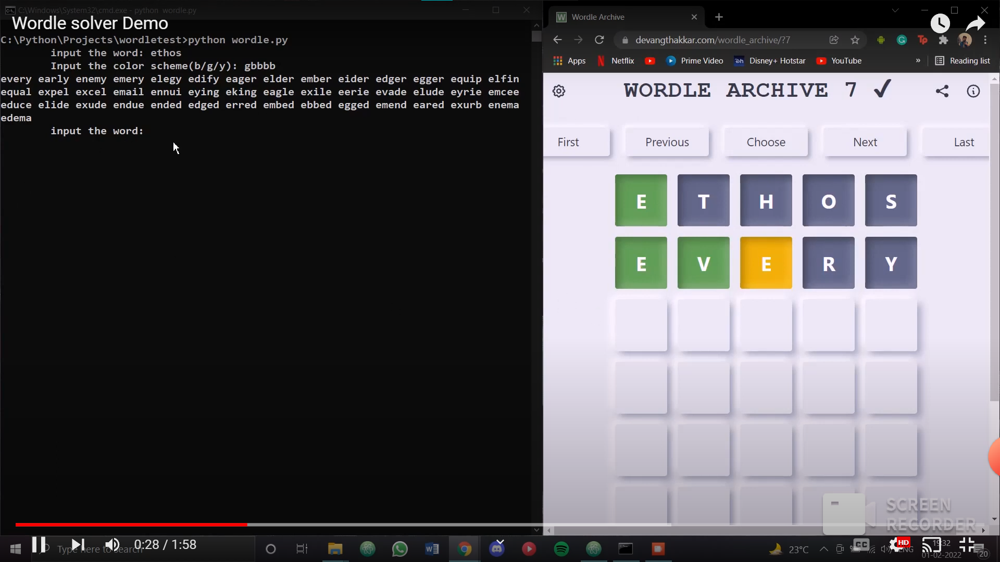

# Wordle Solver

The following code is a simple way of tackling the popular game, **[Wordle](https://www.powerlanguage.co.uk/wordle/)**. It uses a fairly simple way of solving the words by a combination of deduction and guessing. It is a very basic solution which doesn't use automation, but instead depends on user input for operation. It works in these simple steps:

**Steps:**
* **Step 1:** Type in whatever word you want in the actual game and copy the word into the prompt given when the program is run.
* **Step 2:** Type in the color combination of the outcome: say you got no letters correct, type in "bbbbb".
* **Step 3:** The program will output a list of valid words, any of which you can choose and write in the next line.
* **Step 4:** Repeat these steps till either you get the answer or you run out of turns.

This **[YouTube](https://youtu.be/UVlnRTjWnVc)** video shows the algorithm in action:

The solver has been coded in python and is fairly simple:

~~~python
def game_logic(color_scheme, word, position_list, wordlist):
    for key in wordlist:
        for color, letter, position in zip(color_scheme, word, position_list):
            if color.lower() == 'g':
                if letter != key[position]:
                    if key not in altered_wordlist:
                        altered_wordlist.append(key)
            elif color.lower() == 'y':
                if letter not in key or letter == key[position]:
                    if key not in altered_wordlist:
                        altered_wordlist.append(key)
            elif color.lower() == 'b':
                if letter in key:
                    if key not in altered_wordlist:
                        altered_wordlist.append(key)
    for i in range(len(altered_wordlist)):
        if wordlist[i] not in altered_wordlist:
            final_wordlist.append(wordlist[i])
    return scoredlist(final_wordlist)[:5]
~~~

The following function, **game_logic()**, works bases on two user inputs, namely **word** and **color_scheme**. It applies the game logic to all the words stored in the database and eliminates redundant words based on the clues given by the user. It returns a scored list of the top 5 predictions generated by the function **scoredlist()**

~~~python
def scoredlist(final_wordlist):
    alphabets = list(map(chr, range(97, 123)))
    scoredict = {}
    wordscoredict = {}
    sum = 0
    wse=0
    for alphabet in alphabets:
        for word in wordlist:
            for i in range(5):
                if alphabet == word[i]:
                    sum += 1
                score = sum / 5757
                scoredict.update({alphabet : score})

    for word in final_wordlist:
        for letter in word:
            wse =+ scoredict.get(letter)
        wordscoredict.update({word : wse})
    wordscoredict = dict(sorted(wordscoredict.items(), key=operator.itemgetter(1) ,reverse=True))
    return [*wordscoredict]
~~~

The following function, **scoredlist** ranks the outputs based on the probability of getting maximum greens. It does this by ranking each word by how probable it is to appear. A normalized score of each letter in the alphabet is calculated based on how frequently it appears in a given position in the entire dataset. These rankings are then compounded to find out the ranking of each word in the **final_wordlist**. These words paired with their ranking are stored in a dictionary, **wordscoredict**, where they are sorted from highest to lowest rank to maximize the probability of winning the game in as few rounds as possible. The dataset of 5-letter words was taken from **[here](https://www-cs-faculty.stanford.edu/~knuth/sgb-words.txt)**.

This is a very simple solution and more advanced ways to solve the puzzle do exist. The code is pretty first draft so clone the repository and have fun for yourself!
